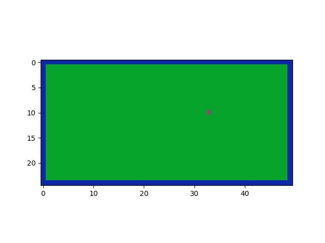
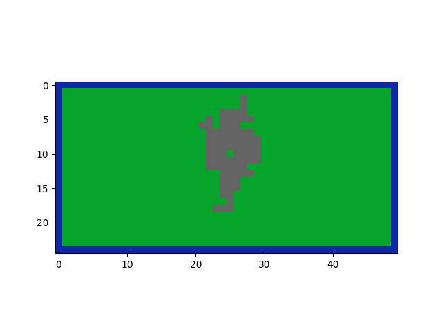
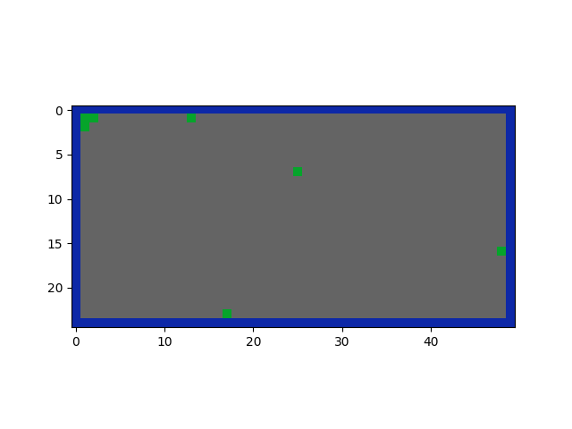

# Analyse des résultats

## Sommaire

* [Objectif de l'étude](#objectif-de-létude)
* [Influence de la probabilité de propagation](#influence-de-la-probabilité-de-propagation)
    * [Rappel des paramètres de la simulation](#rappel-des-paramètres-de-la-simulation)
    * [Faible probabilité](#faible-probabilité)
    * [Probabilité intermédiaire](#probabilité-intermédiaire)
    * [Forte probabilité](#forte-probabilité)
* [Notion de percolation](#notion-de-percolation)
* [Seuil critique](#seuil-critique)
* [Limites du modèle](#limites-du-modèle)
* [Conclusion](#conclusion)

---

# Objectif de l'étude

Cette simulation permet d'étudier l'influence de la probabilité de propagation `p` sur l'évolution d'un incendie dans une forêt modélisée sous forme d'une grille.

Lorsqu'un arbre est en feu, il peut transmettre le feu à ses voisins directs avec une probabilité `p`.

L'objectif est d'observer comment une modification de cette probabilité influence :

* la surface totale brûlée ;
* la formation de zones brûlées ;
* la survie de zones d'arbres ;
* la possibilité pour le feu de traverser une grande partie de la forêt.

---

# Influence de la probabilité de propagation

## Rappel des paramètres de la simulation

| Paramètre | Utilité                                                   |
| --------- | --------------------------------------------------------- |
| p         | Probabilité de propagation du feu                         |
| bordure   | Boolean qui indique si la forêt posède une bordure        |
| hauteur   | Hauteur en pixel de la simulation                         |
| longeur   | Longeur en pixel de la simulation                         |
| facteur   | Facteur d'agrandisement des pixel de la simulation (zoom) |

Pour l'ensemble des simulations effectuer durant cette analyse les paramètres par défaut sont les suivants :

```text
bordure = True
hauteur, longeur = 25, 50
facteur = 20
```

Un 'zoom' est effectué pour mieux perçevoir la simulation

## Faible probabilité

Pour des valeurs faibles de `p`, le feu a peu de chances de se propager aux arbres voisins.

L'incendie s'éteint souvent rapidement.

Exemple :

```text
p = 0.1
```



Dans ce cas, seul un arbre de la forêt a été bruler.

---

## Probabilité intermédiaire

Lorsque la probabilité de propagation augmente, les zones brûlées deviennent plus importantes.

Le feu peut former plusieurs groupes d'arbres brûlés et atteindre des zones plus éloignées du point de départ.

Exemple :

```text
p = 0.4
```



La propagation reste cependant aléatoire et certaines zones peuvent rester intactes.

---

## Forte probabilité

Pour des valeurs élevées de `p`, le feu se propage beaucoup plus facilement entre les arbres voisins.

Une grande partie de la forêt peut alors être détruite.

Exemple :

```text
p = 0.8
```



Dans cette situation, la propagation devient beaucoup plus importante et le feu a tendance à occuper une grande partie de la grille.

---

# Notion de percolation

La percolation est un phénomène étudié en physique statistique et en mathématiques.

Dans un modèle de percolation, on cherche à déterminer à partir de quelle probabilité apparaît un chemin continu permettant de relier deux régions d'un système.

Dans le contexte de cette simulation, on peut interpréter la percolation comme la capacité du feu à former une propagation continue à travers une partie importante de la forêt.

En dessous d'une certaine probabilité, le feu reste généralement limité à de petites zones.

Au-dessus d'un seuil critique, il devient possible qu'une grande zone connectée apparaisse et que le feu se propage sur une distance importante.

---

# Seuil critique

En effectuant une étude expérimentale sur plusieurs valeurs de la probabilité de propagation `p`, on constate un changement significatif du comportement de la simulation autour de la valeur `p = 0,5`.

En dessous de cette valeur, le feu a tendance à s'éteindre relativement rapidement et les zones brûlées restent limitées.

À partir d'une probabilité proche de `0,5`, la propagation devient beaucoup plus importante et le feu peut traverser une grande partie de la forêt. Ce changement de comportement peut être rapproché de la notion de seuil critique en théorie de la percolation.

Les résultats expérimentaux obtenus suggèrent donc que le seuil critique de ce modèle se situe aux alentours de :

```text
p_c ≈ 0,5
```


Dans cette simulation, la forêt ne brûle que partiellement. Certaines zones sont détruites par l'incendie tandis que d'autres restent intactes.

Ce comportement illustre la zone de transition autour du seuil critique : la propagation du feu devient suffisamment importante pour former de grandes zones brûlées, sans pour autant détruire systématiquement l'ensemble de la forêt.

⚠️ Pour chaque valeur de `p`, plusieurs simulations ont été réalisées afin de prendre en compte le caractère aléatoire de la propagation.

---

# Limites du modèle

Cette simulation représente un modèle volontairement simplifié de propagation d'un incendie.

Plusieurs phénomènes réels ne sont pas pris en compte :

* influence du vent ;
* humidité des arbres ;
* différents types de végétation ;
* relief du terrain ;
* propagation diagonale ;
* évolution de la température ;
* conditions météorologiques.

Ces éléments pourraient être ajoutés dans de futures versions afin d'obtenir un modèle plus réaliste.

---

# Conclusion

Cette simulation permet d'observer comment une règle locale simple peut produire des comportements globaux complexes.

Pour de faibles valeurs de `p`, le feu s'éteint rapidement. Lorsque cette probabilité augmente, des zones brûlées de plus en plus importantes apparaissent.

L'étude expérimentale réalisée met en évidence un changement significatif du comportement de la simulation autour de p = 0,5. Cette transition peut être rapprochée de la notion de seuil critique étudiée dans la théorie de la percolation.